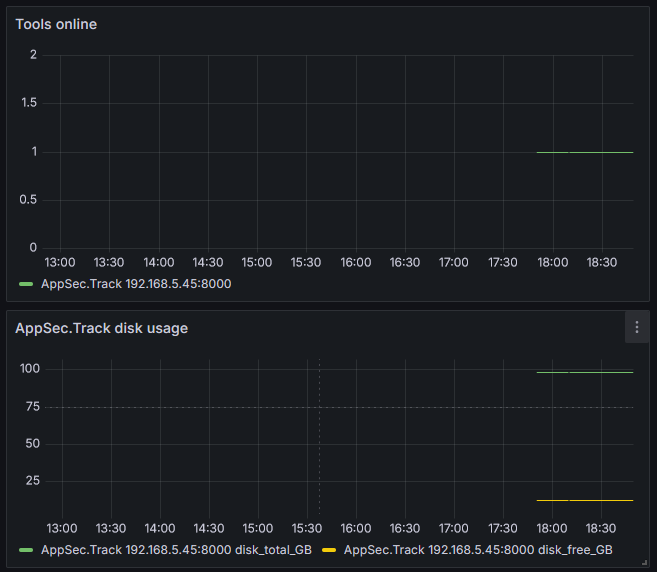

Для выяснение необходимых параметров запросов использую Postman 
Ручка `/actuator/health/custom` возвращает:

```json 
{
    "status": "UP",
    "components": {
        "diskSpace": {
            "status": "UP",
            "details": {
                "total": 105581297664,
                "free": 13111955456,
                "threshold": 10485760,
                "exists": true
            }
        },
        "ping": {
            "status": "UP"
        }
    }
}
```

Создаём свой класс в котором будут поля для отслеживаемых значений 
```python

class TrackHealthExporter:  
    def __init__(self, track_url):  
        ...    
        self.health_status = 0  # 0 — не работает, 1 — работает  
        self.disk_total = 0.0  
        self.disk_free = 0.0  
        self.requests_total = 0
```

В нём метод с запросом и обработкой его результатов 
```python
def check_health(self):  
    try:  
        # Sending the request to the specified URL  
        response = requests.get(f"{self.track_url}/actuator/health/custom",  
                                timeout=2, verify=False)  
        response.raise_for_status()  # Raises an error for bad response
        self.requests_total += 1    
        health_data = response.json() 
        if not health_data:  
            logger.warning("JSON is empty")  
            return  
        if health_data.get("status") == "UP":  
            self.health_status = 1  
        else:  
            
            self.health_status = 0  
        if "components" in health_data and "diskSpace" in health_data["components"]:  
            if health_data["components"]["diskSpace"]["status"] == "UP":  
                self.disk_total = round(health_data["components"]["diskSpace"]["details"]["total"] / (1024 ** 3), 2)  
                self.disk_free = round(health_data["components"]["diskSpace"]["details"]["free"] / (1024 ** 3), 2)  
  
    except requests.RequestException as e:  
        logger.error(f"Request failed: {e}")  
        self.health_status = 0
```
И обязательно должна быть метод `collect(self)` который возвращает итерируемый объект метрик. 
```python
def collect(self):  # переопределение метода библиотеки prometheus_client  
    self.check_health()  # Выполняем проверку перед сбором метрик  
  
    health_metric = GaugeMetricFamily(  
        "track_health_status",  
        "Состояние Бэкенда Трека",  
        labels=["service"]  
    )  
    health_metric.add_metric(["UP"], self.health_status)  
    health_metric.add_metric(["disk_total_GB"], self.disk_total)  
    health_metric.add_metric(["disk_free_GB"], self.disk_free)  
    yield health_metric 
```
Используем FastApi на ручке `/metrics` определяем метод `metrics`, который возвращает страницу с метриками. 

```python
@app.get("/metrics")  
def metrics():  
    return Response(generate_latest(), media_type=CONTENT_TYPE_LATEST)
```

В конфиг `prometheus.yml` добавляем задачу сбора метрик 
```yaml
  - job_name: 'track'
    metrics_path: /metrics
    scrape_interval: 2s
    static_configs:
    - targets: ['192.168.5.45:8000']
```

На дашборде графаны такие метрики можно отобразить так:


