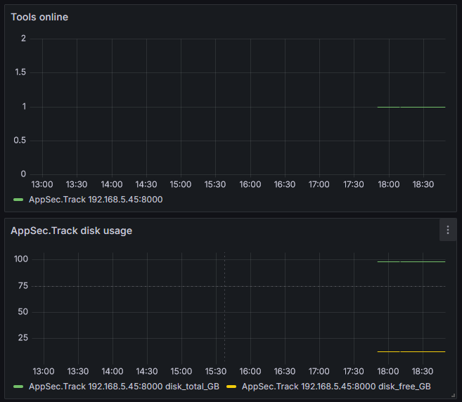

Предлагаю такой процесс создание экспортеров метрик для инструментов

Смотрим, что можно получить от инструмента 
Ручка `/actuator/health/custom` Appsec.Track например возвращает:

```json 
{
    "status": "UP",
    "components": {
        "diskSpace": {
            "status": "UP",
            "details": {
                "total": 105581297664,
                "free": 13111955456,
                "threshold": 10485760,
                "exists": true
            }
        },
        "ping": {
            "status": "UP"
        }
    }
}
```

В конфиге `config.yml` описываем параметры необходимые для подключения
```yaml
track:
  backend_1:
    protocol: "http"
    adr: "172.16.34.19"
    port: 32401
  backend_2:
    protocol: "https"
    adr: "track.demo.appsec.global"
    port: 33333
```

Его распарсим в словарь из словарей с именами бэкендов которые уже используем для запросов и распределения метрик по лейблам (метрикам).

Создаём под инструмент класс при инициализации которого создаём экземпляры метрик для отслеживаемых значений. 
У меня в примере используются Counter (счетчик, только возрастае или сбрасывается в 0) и Gauge ( измеритель, может и увеличиваться и уменьшаться)
Имя метрики должно быть уникалным. Есть рекомендация по именованию 

```python
from prometheus_client import generate_latest, CONTENT_TYPE_LATEST, Counter, Gauge
...
class TrackHealthExporter:
    def __init__(self,track: Dict[str, Dict[str, Any]]) -> None:
        self.track = track
        self._requests_status = Counter(
            name="track_requests_count",
            documentation="Количество запросов статуса отправленных на бэкенд трека",
            labelnames=["backend_name", "backend_adr", "backend_port"],
        )
        self._track_status = Gauge(
            name="track_statu",
            documentation="Отслеживание работает ли бэкенд трека",
            labelnames=["backend_name", "backend_adr", "backend_port"],
        )
        self._track_disk = Gauge(
            name="track_disk",
            documentation="Пространство на диске бэкенд трека",
            labelnames=["backend_name", "backend_adr", "backend_port", "state"],
        )
```

И в нём же метод с запросом и обработкой его результатов 
```python
    def check_health(self):
        for backend_name, backend_config in self.track.items():
            try:
                response = requests.get(f"{backend_config.get('protocol')}://{backend_config.get('adr')}:{backend_config.get('port')}/actuator/health/custom",
                                        timeout=1, verify=False)
                response.raise_for_status()  # Raises an error for bad responses (4xx/5xx)
                self._requests_status.labels(backend_name=backend_name, backend_adr=backend_config.get('adr'), backend_port=backend_config.get('port')).inc()
                health_data = response.json()
                if not health_data:
                    logger.warning("JSON is empty")
                    return

                if health_data.get("status") == "UP":
                    self._track_status.labels(backend_name=backend_name, backend_adr=backend_config.get('adr'), backend_port=backend_config.get('port')).set(1)
                else:
                    self._track_status.labels(backend_name=backend_name, backend_adr=backend_config.get('adr'), backend_port=backend_config.get('port')).set(0)
                if "components" in health_data and "diskSpace" in health_data["components"]:
                    if health_data["components"]["diskSpace"]["status"] == "UP":
                        self._track_disk.labels(
                            backend_name=backend_name,
                            backend_adr=backend_config.get('adr'),
                            backend_port=backend_config.get('port'),
                            state="total"
                        ).set(
                            round(health_data["components"]["diskSpace"]["details"]["total"] / (1024 ** 3), 4)
                        )
                        self._track_disk.labels(
                            backend_name=backend_name,
                            backend_adr=backend_config.get('adr'),
                            backend_port=backend_config.get('port'),
                            state="free"
                        ).set(
                            round(health_data["components"]["diskSpace"]["details"]["free"] / (1024 ** 3), 4)
                        )

            except requests.RequestException as e:
                logger.error(f"Request failed: {e}")
                self._track_status.labels(backend_name=backend_name, backend_adr=backend_config.get('adr'), backend_port=backend_config.get('port')).set(0)
```

Используем FastApi на ручке `/metrics` определяем метод `metrics`, который возвращает страницу с метриками. 
```python
@app.get("/metrics")
def metrics():
    track_health_exporter.check_health() 
    return Response(generate_latest(), media_type=CONTENT_TYPE_LATEST)
```

Для тестов думаю будет достаточно локально запустить и провереть, что запросы в инструмент проходят и их результаты оторисовывается в метрики:
http://localhost:8000/metrics

```
# HELP python_gc_objects_collected_total Objects collected during gc
# TYPE python_gc_objects_collected_total counter
python_gc_objects_collected_total{generation="0"} 2330.0
python_gc_objects_collected_total{generation="1"} 3381.0
python_gc_objects_collected_total{generation="2"} 996.0
# HELP python_gc_objects_uncollectable_total Uncollectable objects found during GC
# TYPE python_gc_objects_uncollectable_total counter
python_gc_objects_uncollectable_total{generation="0"} 0.0
python_gc_objects_uncollectable_total{generation="1"} 0.0
python_gc_objects_uncollectable_total{generation="2"} 0.0
# HELP python_gc_collections_total Number of times this generation was collected
# TYPE python_gc_collections_total counter
python_gc_collections_total{generation="0"} 152.0
python_gc_collections_total{generation="1"} 13.0
python_gc_collections_total{generation="2"} 1.0
# HELP python_info Python platform information
# TYPE python_info gauge
python_info{implementation="CPython",major="3",minor="12",patchlevel="7",version="3.12.7"} 1.0
# HELP track_requests_count_total Количество запросов статуса отправленных на бэкенд трека
# TYPE track_requests_count_total counter
track_requests_count_total{backend_adr="172.16.34.19",backend_name="backend_1",backend_port="32401"} 5.0
# HELP track_requests_count_created Количество запросов статуса отправленных на бэкенд трека
# TYPE track_requests_count_created gauge
track_requests_count_created{backend_adr="172.16.34.19",backend_name="backend_1",backend_port="32401"} 1.729676194563058e+09
# HELP track_statu Отслеживание работает ли бэкенд трека
# TYPE track_statu gauge
track_statu{backend_adr="172.16.34.19",backend_name="backend_1",backend_port="32401"} 1.0
track_statu{backend_adr="track.demo.appsec.global",backend_name="backend_2",backend_port="33333"} 0.0
# HELP track_disk Пространство на диске бэкенд трека
# TYPE track_disk gauge
track_disk{backend_adr="172.16.34.19",backend_name="backend_1",backend_port="32401",state="total"} 98.3302
track_disk{backend_adr="172.16.34.19",backend_name="backend_1",backend_port="32401",state="free"} 12.1594
```


Далее собираем контенер и поднимаем его.
В конфиг `prometheus.yml` добавляем задачу сбора метрик 
```yaml
  - job_name: 'track'
    metrics_path: /metrics
    scrape_interval: 2s
    static_configs:
    - targets: ['192.168.5.45:8000']
```

На дашборде графаны такие метрики можно отобразить так:


